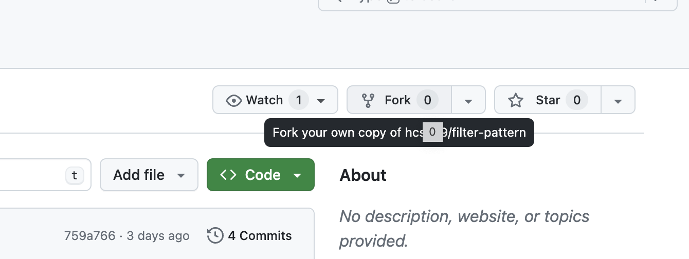
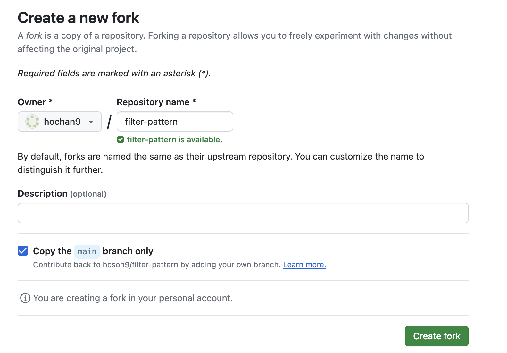
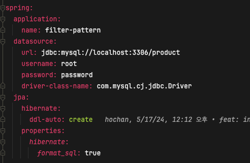
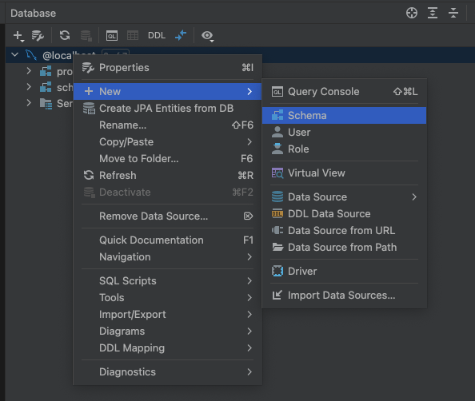
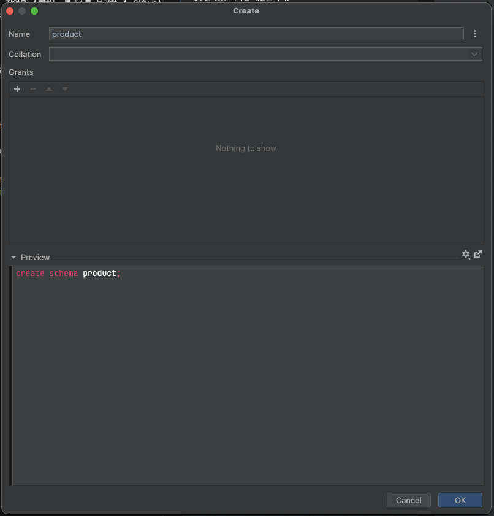

# 개요
> 책임 연쇄 패턴에 대한 실습을 해봅시다

# 목차
- [책임 연쇄 패턴이란?](#책임-연쇄-패턴이란)

## 주요 내용

- Servlet Filter 에 대한 내용과 실제 책임 연쇄 패턴에 대한 실습을 진행해보자.

----
## 책임 연쇄 패턴이란?

### 의도
> 책임 연쇄 패턴은 핸들러들의 체인(사슬)을 따라 요청을 전달할 수 있게 해주는 행동 디자인 패턴입니다.  
> 
> 각 핸들러는 요청을 받으면 요청을 처리할지 아니면 체인의 다음 핸들러로 전달할지를 결정합니다.


즉, 체인형식 과 같이 각각의 객체에서 처리합니다.
```
필터1 -> 필터2 -> 필터3
```

### 장점
1. 요청의 처리 순서를 제어할 수 있습니다. -> 원하는 순서에 처리순서를 넣을 수 있습니다.
2. 단일 책임 원칙. 작업을 수행하는 클래스를 분리할 수 있습니다.
3. 개방/폐쇠의 원칙. -> 기존 코드를 수정하지 않고 새로운 작업을 도입할 수 있습니다.


### 단점
1. 일부 요청은 도달할 수 없습니다.

---

## 실행 전 체크사항
- 프로젝트를 개인 git repository 에 복사합니다.
- 프로젝트를 구동하기 전에 DB 스키마를 생성해줘야 합니다.

### 1. fork 로 repository 개인 git 으로 복사



### 2. DB 정보 확인

- database 의 접속 정보를 맞춰주세요.

### 3. product 스키마 생성



혹은 아래의 sql 문 실행
```sql
create schema product;
```